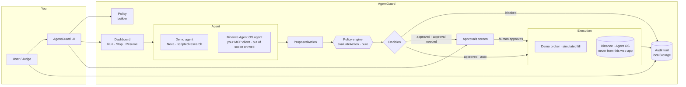

# AgentGuard — Architecture

## Flow

Every agent action travels one pipeline. The policy engine is a pure function in the middle;
everything around it (agent, approvals, broker) is an adapter around that core.



The design rule: **AgentGuard decides intent, adapters execute**. Demo Mode swaps the agent and the
broker for honest simulations; Live Mode keeps the exact same engine and approval gates.

## Data model

All four core shapes live in [`src/lib/engine/types.ts`](src/lib/engine/types.ts) as plain JSON:

```
Policy                the mandate a human controls
ProposedAction        what an agent wants to do (kind · market · symbol · side · notionalUsd · estRiskUsd)
PolicyCheck           one rule evaluated against the action (rule · passed · detail)
Decision              state · checks · blockedBy · requiresApproval · exposureAfterUsd
AuditEvent            one row of the trail (id · seq · ts · event · tone · action · checks · verdict …)
```

- **Exposure model** — running USD notional from *executed buys* (derived from the audit feed, so it
  can never drift from what the trail says happened). Sells reduce it; transfers/withdrawals don't
  increase capital at risk.
- **Approval semantics** — `Decision.requiresApproval` is true when the action is approved *and*
  `policy.requireApproval`. Awaiting decisions are derived, never stored separately: the approvals
  screen filters the audit feed for `verdict==='approved' && approvalState==='awaiting'`. When the
  human approves, the action is **re-evaluated against the current policy** (it may have changed
  while waiting), then executed or re-blocked accordingly.

## Modules

| Module | File(s) | Responsibility |
|---|---|---|
| Policy engine | `src/lib/engine/policy.ts` | Pure `evaluateAction`; 6 deterministic rules |
| Domain types | `src/lib/engine/types.ts` | Serialisable contracts + audit events |
| Defaults | `src/lib/engine/defaults.ts` | Sample “Guardian mandate” matching the judge script |
| Demo script | `src/lib/demo/script.ts` | The 9-beat timeline Nova follows (3 research beats + 6 proposals); verdicts are *not* pre-decided |
| Quotes | `src/lib/demo/quotes.ts` | Labelled fallback quotes (never presented as live) |
| Market data | `src/lib/market.ts` + `/api/market/snapshot` | Keyless Binance public `ticker/24hr` with live/fallback |
| State machine | `src/lib/store/state.ts` | Reducer, exposure & pending derivations |
| Runner | `src/lib/store/AgentGuardProvider.tsx` | The agent loop: advance script → propose → engine → approve/execute; emergency stop; persistence |
| Persistence | `src/lib/store/storage.ts` | localStorage slice (policy · audit · progress) |
| Shell | `src/components/app/AppShell.tsx` | Header (mode, emergency stop), bottom nav, ErrorBoundary; **content is never gated on hydration** — children render in static HTML, so a slow/failed client effect can never freeze the app |
| Decision UI | `src/components/decision/DecisionCard.tsx` | Verdict card: action, checks, reason (blocked rows prefix the failing rule), Approve/Decline |
| Audit feed | `src/components/feed/EventFeed.tsx` | Rich feed + dense audit rows; each decision row shows proposal → verdict chip → exact reason → approval state → execution state |

## Threading model (client-only, no server database)

All runtime state is in a single React context under `/app`. The audit feed is the source of truth;
**no server DB** — the trail persists to `localStorage` (`agentguard:v1`), so the $0/free constraints
are respected and judges' runs survive reloads. The only server route is the market snapshot.

The demo runner is event-driven and **pause-safe**:

```
Run → begin-demo (clears feed, status=running)
    → step(research)   → append research event · schedule next
    → step(action)     → evaluateAction(policy, action, exposure)
                         ├─ blocked        → append decision · schedule next
                         ├─ approved+gate  → append decision (awaiting) · status=awaiting-approval · STOP for human
                         └─ approved auto  → append decision + executed · schedule next
    → human Approve    → re-evaluate under current policy → approved/executed or re-blocked · continue
    → finish           → summary event · status=idle
Emergency stop → clears timers · status=stopped (approval while stopped records intent but never executes)
```

## Trust boundaries

| Layer | Trust | Notes |
|---|---|---|
| Policy engine | high — pure & tested | Same code on client, server, tests |
| Demo agent/broker | simulated | Clearly labelled; no real orders, no deposit |
| Binance public market data | keyless read | Label of each quote says `live` or `fallback` |
| Binance Agent OS live execution | NOT in web app | Personal, desktop-onboarded; runbook only |
| Secrets | none | `.env*` gitignored; no keys in frontend code or logs |

## Live Mode extension point

`evaluateAction(policy, action, exposureUsd)` is the contract. A live integration keeps the engine
and the approval gate and only swaps two adapters: the **agent** (feed it an Agent OS / MCP agent's
intents instead of the demo script) and the **executor** (place the approved action through the
user's own Agent OS connection). No policy logic, audit schema or UI needs to change. Nothing in this
repo executes on Binance without a user-configured, account-scoped agent of their own.

## Research log — Binance Agent OS (the record)

What was verified and how, so nobody assumes invented APIs:

- **Date/method:** 2026-09-04. Direct access to `binance.com` and `developers.binance.com` is
  geo-blocked from a US-based build sandbox; official pages were fetched via the `r.jina.ai` reader
  proxy. GitHub and npm were accessed directly.
- **Binance Agent OS** = developer platform connecting AI agents to Binance via the Binance MCP
  Server, exchange APIs, and ready-made skills.
  Source: https://www.binance.com/en/agent-os (CONNECT / BUILD / **CONTROL**).
- **Binance MCP Server** — hosted remote MCP added in an MCP client (Claude Code, Claude Desktop,
  Codex CLI, ChatGPT web/desktop, VS Code, Grok). **Desktop-only onboarding; never paste the endpoint
  into a chat.** OAuth consent grants scopes to a dedicated **Agentic sub-account**: Market data
  (public) · Account · Trade (spot/margin/convert/USDⓈ-M/COIN-M) · Transfer (inside the sub-account
  only). **No withdrawal scope.** Every trade/transfer is confirmed by the user first.
  Source: https://developers.binance.com/en/docs/agent-native/mcp-server/agentic
- **Agent Native docs index / llms.txt:** https://developers.binance.com/en/docs/agent-native/overview
  and `/llms-txt`; full machine-readable docs at `/docs/llms.txt` + `/docs/llms-full.txt`.
- **Skills Hub:** https://github.com/binance/binance-skills-hub — `SKILL.md` skills; the `binance`
  skill drives Spot/Futures(USD-S)/Convert through `binance-cli` v2 with `BINANCE_API_KEY` /
  `BINANCE_SECRET_KEY` / `BINANCE_API_ENV` ∈ `prod|testnet|demo`. No official `binance-mcp` or
  `binance-agent-os` repository exists under `org:binance` (checked via GitHub API); the
  `binance-mcp-server` packages on npm are third-party and were **not** treated as authoritative.
- **Consequence:** AgentGuard's only live Binance call is the *public keyless* market surface
  documented in the developer quick-start (`GET /api/v3/ticker/24hr`). Everything requiring
  credentials/consent is gated behind the user's own desktop Agent OS wiring and documented as a
  runbook — never faked, never given credentials.

*Read the source pages before extending anything live; capabilities change.*
